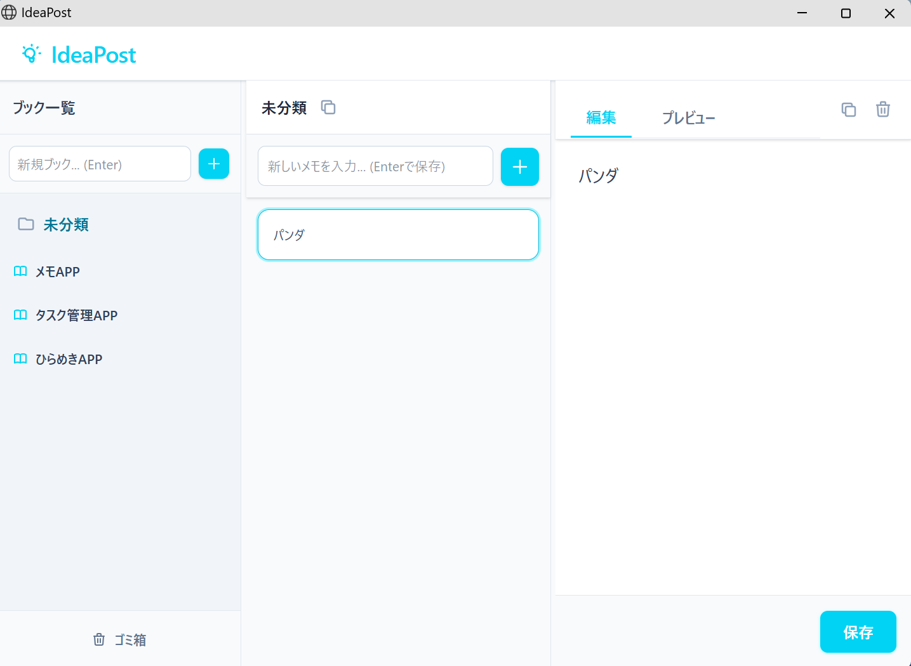
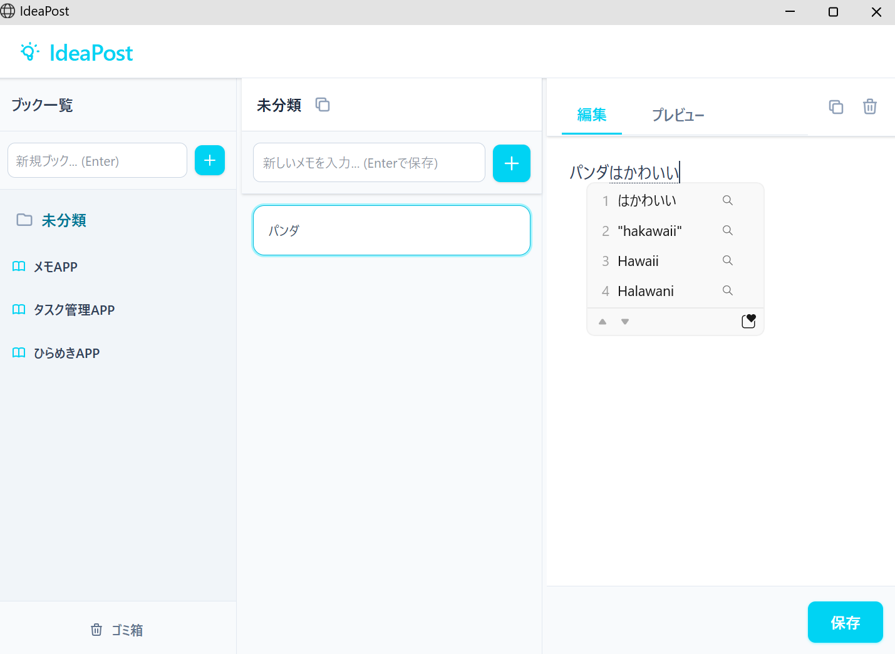
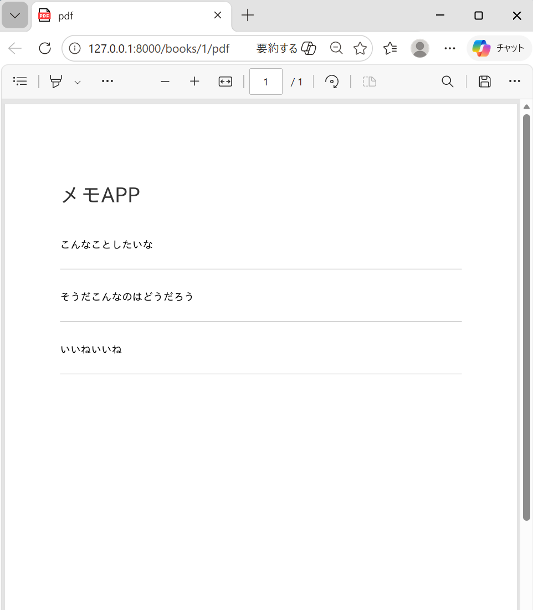
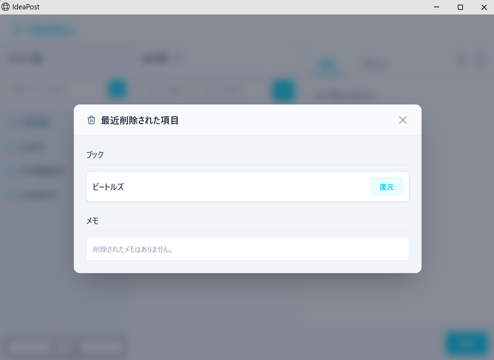
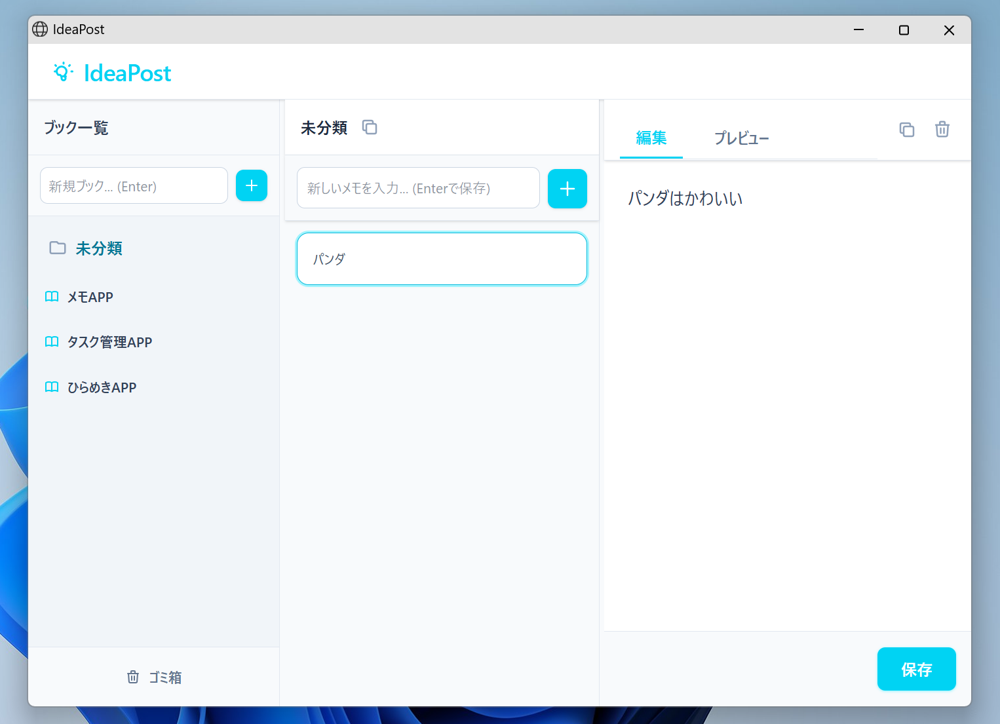

# 💡 IdeaPost

> アイデアをすばやくメモし、ブックで整理する、ローカル動作の高速メモアプリ。



---

## ✨ 特徴

- **3カラムレイアウト** — ブック一覧・メモ一覧・編集エリアを並列表示
- **Quick Add** — テキストフォームに入力して `Enter` を押すだけでメモ/ブックを即時保存
- **Markdownサポート** — メモはMarkdown記法で記述でき、プレビューも確認可能
- **PDF出力** — ブック単位でPDF出力（日本語フォント対応）
- **ドラッグ＆ドロップ** — メモを別のブックへD&Dで移動・並べ替え
- **ゴミ箱・復元** — 削除したブック/メモは直近のものを一覧から復元可能
- **ブック名インライン編集** — ✏️ アイコンから即時リネーム
- **カラム幅調整** — 境界線をドラッグして各カラムの幅を自由にリサイズ
- **クリップボードコピー** — ブック全体/個別メモをワンクリックでコピー
- **ローカル完結** — データはすべてローカルのSQLiteに保存

---

## 📸 スクリーンショット

### メイン画面（3カラムレイアウト）


### メモ編集（Markdownサポート）


### PDF出力


### ゴミ箱・復元


### デスクトップアプリとして起動


---

## 🚀 セットアップ

### 必要環境

- PHP 8.2+
- Composer
- Node.js / npm

### インストール手順

```bash
# 1. リポジトリをクローン
git clone https://github.com/sakurisaya/IdeaPost.git
cd IdeaPost

# 2. PHP依存パッケージをインストール
composer install

# 3. フロントエンド依存パッケージをインストール＆ビルド
npm install
npm run build

# 4. 環境ファイルを作成
cp .env.example .env
php artisan key:generate

# 5. データベースを初期化（SQLite）
touch database/database.sqlite
php artisan migrate
```

---

## ▶️ 起動方法

### 方法①：バッチファイルで起動（推奨）

`IdeaPost.bat` をダブルクリックするだけで起動できます。

- PHPサーバーを自動起動
- Microsoft Edgeが**アプリモード**（アドレスバーなし）で自動的に開きます

```
IdeaPost.bat をダブルクリック → Edgeアプリウィンドウが開く
```

> **デスクトップショートカット作成：** `IdeaPost.bat` を右クリック → ショートカットの作成 → デスクトップへ移動

---

## 📖 使い方

### ブックを作成する
- 左カラム上部の入力欄にブック名を入力して `Enter`

### ブック名を変更する
- ブック名にホバー → ✏️ アイコンをクリック → 入力して `Enter`

### メモを追加する
- 中央カラム上部の入力欄にメモ内容を入力して `Enter`

### メモを編集する
- メモカードをクリックして右カラムで編集 → `Enter` で保存（`Shift+Enter` で改行）

### PDF出力する
- ブック名にホバー → 📄 アイコンをクリック

### 削除したデータを復元する
- 左カラム下部の **「ゴミ箱」ボタン** → 直近削除したブック/メモを復元可能

---

## 🗂️ ディレクトリ構成（主要ファイル）

```
IdeaPost/
├── app/
│   ├── Http/Controllers/
│   │   ├── BookController.php   # ブック CRUD + PDF出力
│   │   └── NoteController.php   # メモ CRUD + 並べ替え
│   └── Models/
│       ├── Book.php             # ソフトデリート対応
│       └── Note.php
├── resources/views/
│   ├── layouts/app.blade.php    # 共通レイアウト
│   └── home.blade.php           # メインUI
├── routes/web.php               # ルーティング
├── storage/fonts/               # IPAexGothicフォント（PDF用）
├── IdeaPost.bat                 # Windows 起動スクリプト
└── IdeaPost.ps1                 # PowerShellバックエンド
```

---

## 🛠️ 技術スタック

| 区分 | 技術 |
|---|---|
| バックエンド | Laravel 11 / PHP 8.2 |
| データベース | SQLite |
| フロントエンド | Blade / Tailwind CSS v4 |
| PDF生成 | Dompdf + IPAexGothicフォント |
| Markdown | League/CommonMark |
| D&D | SortableJS |

---

## 📝 ライセンス

MIT License
